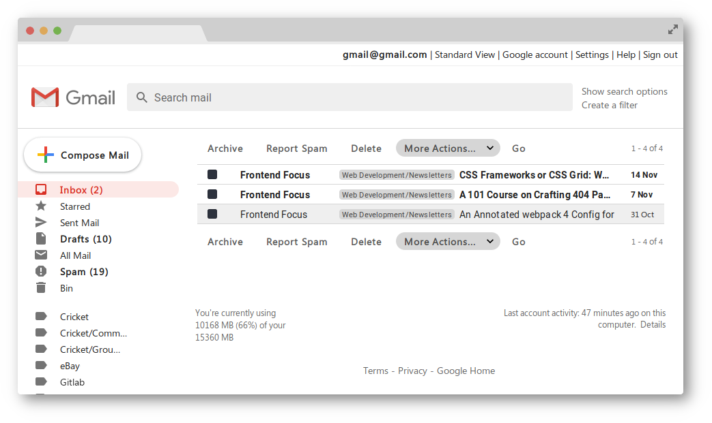

# Gmail Basic HTML Theme

Updates the styling of the basic HTML Gmail view to that of the full fat JavaScript version (as much as possible), using custom styles in Firefox.

## Installation

Firefox reads custom styles from `userContent.css`, found in the `chrome` sub-directory of your __profile__ directory. [Instructions on how to find your profile directory](https://support.mozilla.org/en-US/kb/profiles-where-firefox-stores-user-data#w_how-do-i-find-my-profile).

Therefore, we simply need to place our custom styles in the correct location.

### 1. Download the theme. 

Either:

* Use the download button. You will need to decompress/unzip the downloaded files.
* `git clone https://gitlab.com/adamrutter/gmail-basic-html-theme.git` if you are using a CLI.

### 2. Enable some options

We need to enable some essential syntax to ensure the styles only apply where we want them to:

* Open the [about:config](about:config) page.
* Search for `layout.css.moz-document.content.enabled`.
* Change `layout.css.moz-document.content.enabled` to `true` by double clicking.

### 3. Add the theme to your `chrome` directory

Now we just need to move the downloaded styles to our `chrome` directory, a sub-directory of your __profile__ directory.

__If you already have a `userContent.css` in this directory__, the content of the downloaded `userContent.css` should be appended to the existing file. You can:

* Copy/paste the content of the downloaded `userContent.css` to your current file using a text editor.
* Use a command such as `cat` in the CLI. `cat ~/Downloads/userContent.css > ~/path/to/your/profile/chrome/userContent.css` _Note: `~/path/to/your/profile` should obviously be replaced with the path to your profile!_

__If you do not already have a `userContent.css`__, you just need to move the downloaded `userContent.css` to the correct directory.

* Move or copy/paste the downloaded `userContent.css` to your `chrome` directory.

## Restrictions

### No modification of HTML

There are some restrictions with bringing the basic HTML Gmail up to date with the modern styling, mainly arising from the inability to modify any HTML code.

One obvious one is using text instead of icons for the mailbox controls. Whilst it would be possible to use icons, it is not possible to use tooltips to indicate what the buttons do. Without being able to add any HTML for tooltips, or add pseduo elements to an `input` (the buttons are an `<input type="submit">`), using icons would mean a poor user experience.

Images can be changed without modifying any HTML though, using CSS background images. By giving an image padding, a `background-image`, and `height: 0; width :0;`, the original image is hidden and only the new background image can be seen. Whilst the client loading two images isn't ideal, wherever this is used it is with icons (ie, a size of no more than ~20px).

Another way we are able to workaround the fixed HTML is using `flexbox` to change the order of elements. By using `display: flex;` on the parent, and the `order` property on children, we can move things around without touching the HTML.

### Old standards

The markup also uses old HTML standards; it uses extensively nested tables for layouts and contains minimal classes and IDs. This makes styling difficult...! For example, the only way to select a certain element on a page might be something like `body > table:nth-of-type(2) td:nth-of-type(2) table:first-of-type td:nth-of-type(2)`, and this makes it very easy to run into problems when the same selector matches something on another page.

The above can be mitigated somewhat with the use of attribute selectors. For example, `table[summary="general settings"] tr:nth-child(2) select` is perfectly reasonable, however when reduced to using something much less specific like `td [bgcolor="#CCCCCC"]`, problems can still occur.

### Unstylable elements

Some elements simply aren't styleable, `<input type="checkbox">` for example. A modern approached might be to use a different element, or a `label` to make styling possible, however as we can't change the HTML, this isn't available to us.

The `select` elements falls into this category, however limited styling of the initial dropdown button is available, excluding the arrow icon. We can hide the default arrow and use our own though, using a `background-image`. This means we can keep the element an obvious dropdown list, and have it matching the theme.

### Responsiveness

No real time has been spent trying to make things more responsive, it is assumed on a mobile device people will be using the Gmail app.
